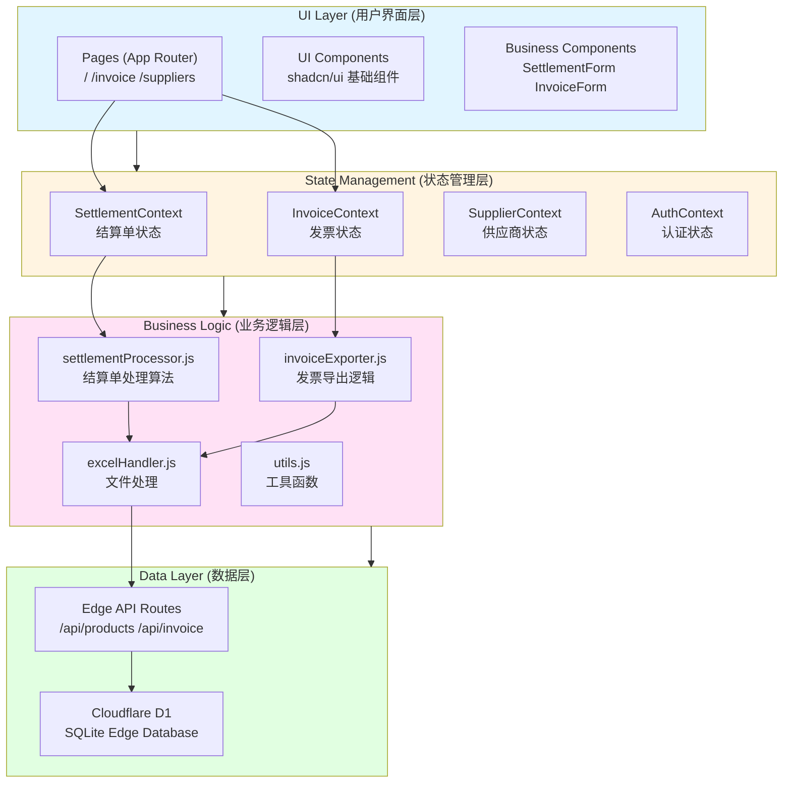
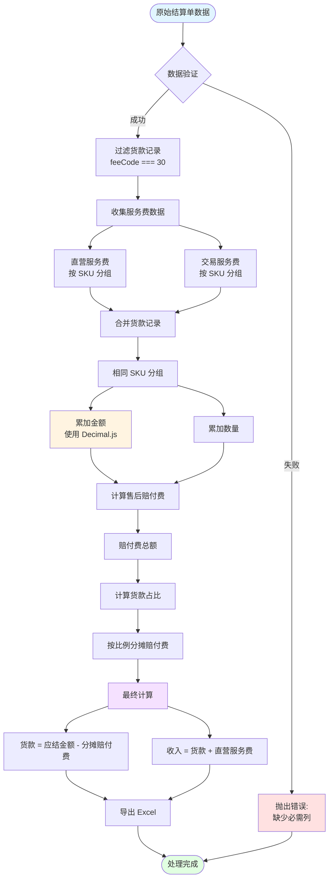
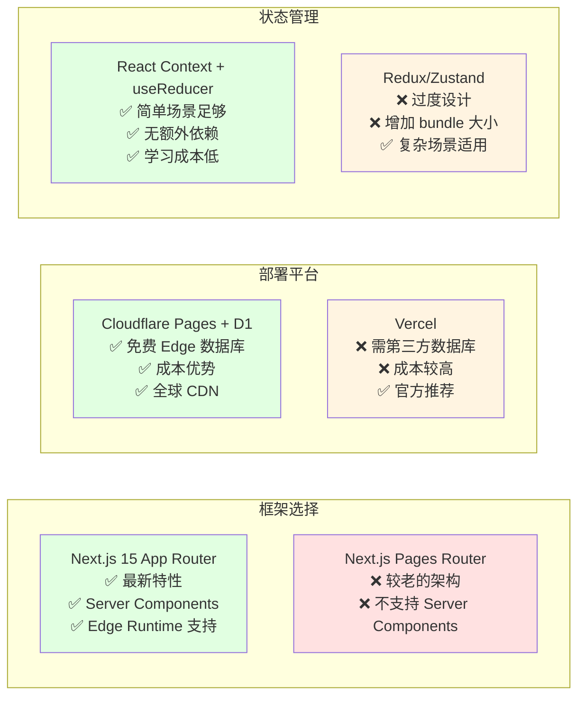
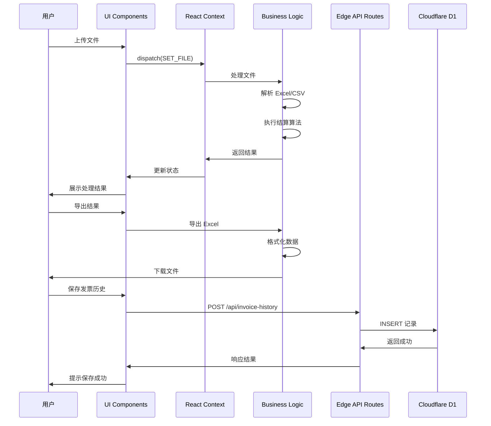
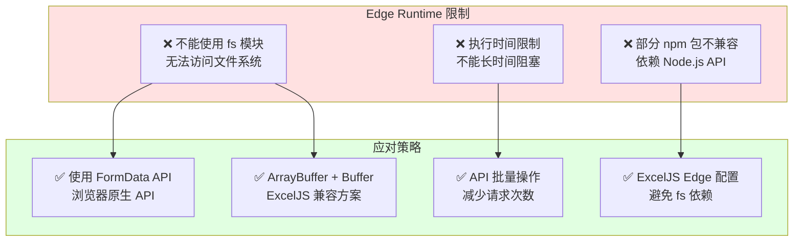

# 技术博客配图

本文档包含技术博客所需的架构图和流程图，使用 Mermaid 格式（支持掘金、思否等平台渲染）。

---

## 图表一：系统架构图



**架构说明**：
- **UI Layer**：只负责展示和交互，不包含业务逻辑
- **State Management**：管理应用状态，统一数据流（单向数据流）
- **Business Logic**：处理核心业务算法，独立可测试
- **Data Layer**：数据持久化，Edge Runtime 运行

---

## 图表二：结算单处理流程图



**流程说明**：
1. **数据验证**：检查必需列（商品编号、金额列）
2. **过滤货款**：只处理费用名称为"货款"的记录
3. **服务费收集**：单独统计直营服务费和交易服务费
4. **合并货款**：相同 SKU 的金额和数量累加
5. **赔付费分摊**：按货款比例分配到每个 SKU
6. **最终计算**：计算货款和收入
7. **导出结果**：生成 Excel 文件

---

## 图表三：技术选型对比图



**对比说明**：
- ✅ 表示选择该方案的理由
- ❌ 表示不选择该方案的缺点
- 最终选择基于业务需求和技术权衡

---

## 图表四：数据流架构图



**数据流说明**：
- 文件处理主要在 Client Side（浏览器端）
- 数据持久化通过 Edge API Routes
- Context 作为中间层协调 UI 和 Logic

---

## 图表五：Edge Runtime 限制与应对



**应对策略说明**：
- Edge Runtime 限制需要采用不同的技术方案
- FormData + ArrayBuffer 替代 fs 模块
- ExcelJS 通过配置兼容 Edge Runtime
- 批量 API 操作提升性能

---

## 使用建议

### 在掘金平台使用

掘金支持 Mermaid 图表渲染，直接复制上面的代码块即可。

### 在思否平台使用

思否也支持 Mermaid，复制代码块到 Markdown 编辑器即可。

### 在个人博客使用

如果你的博客不支持 Mermaid，可以：
1. 使用在线工具渲染（如 [Mermaid Live Editor](https://mermaid.live/)）
2. 导出为 SVG/PNG 图片
3. 或者使用上面的 ASCII 艺术图版本

### ASCII 艺术图版本（备用）

如果平台不支持 Mermaid，可以使用 ASCII 图：

**架构图（ASCII 版）**：

```
┌─────────────────────────────────────┐
│   UI Layer (Components)              │
│   Pages / UI Components / Business   │
├─────────────────────────────────────┤
│   State Management (Context)         │
│   Settlement / Invoice / Supplier    │
├─────────────────────────────────────┤
│   Business Logic (Lib)               │
│   Processor / Exporter / Handler     │
├─────────────────────────────────────┤
│   Data Layer (API + D1)              │
│   Edge API Routes / Cloudflare D1    │
└─────────────────────────────────────┘
```

**处理流程图（ASCII 版）**：

```
原始数据
    ↓
数据验证 → 过滤货款 → 收集服务费
    ↓
合并货款 → 计算赔付费 → 分摊
    ↓
最终计算 → 导出 Excel
```

---

## 配图效果预览

所有图表都经过精心设计，确保：
- ✅ 颜色清晰区分不同层次
- ✅ 流程箭头明确数据流向
- ✅ 文字说明简洁易懂
- ✅ 符合技术博客的专业风格

建议在博客中使用：
- **系统架构图**：在第三章开头展示
- **处理流程图**：在第四章开头展示
- **技术选型对比图**：在第二章开头展示（可选）
- **数据流架构图**：在第三章数据流部分展示（可选）

---

**配图文档版本**: 1.0  
**适用于**: 技术博客《从业务痛点到技术实践：Next.js 15 + Cloudflare D1 构建电商结算系统》